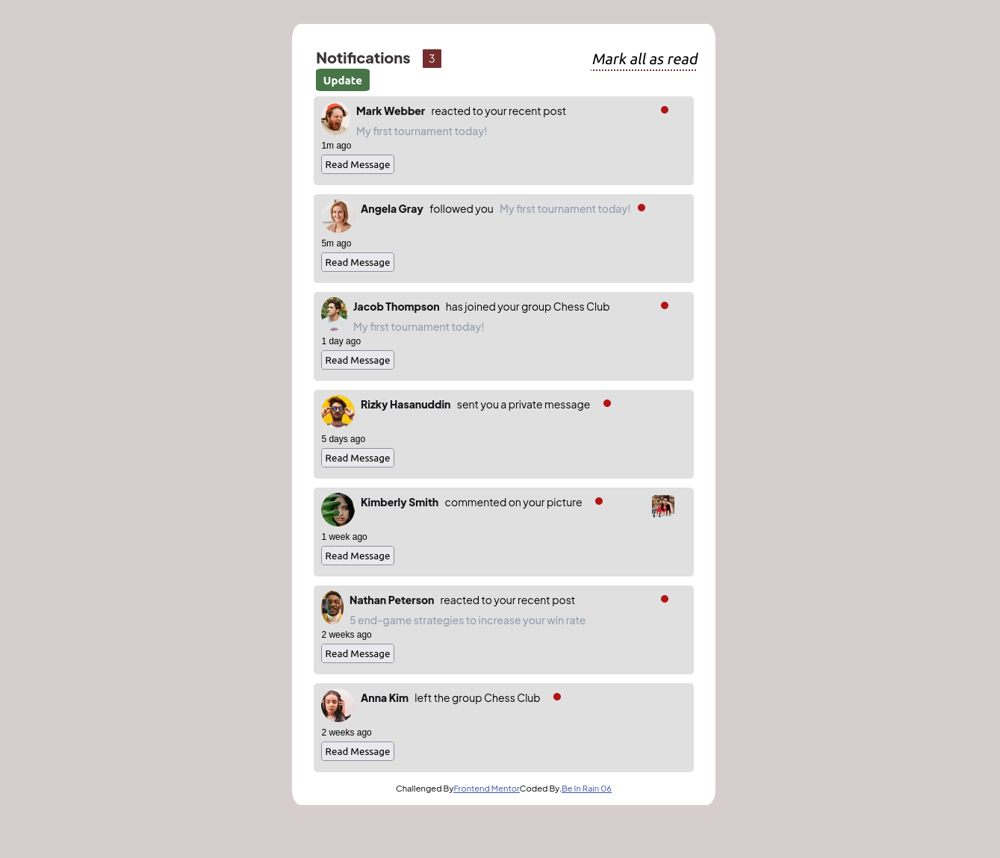
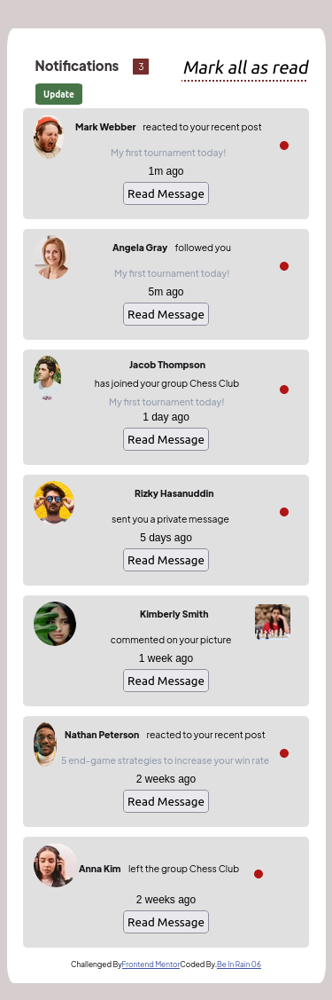

# Frontend Mentor - Notifications page solution

This is a solution to the [Notifications page challenge on Frontend Mentor](https://www.frontendmentor.io/challenges/notifications-page-DqK5QAmKbC). Frontend Mentor challenges help you improve your coding skills by building realistic projects.

## Table of contents

- [Frontend Mentor - Notifications page solution](#frontend-mentor---notifications-page-solution)
  - [Table of contents](#table-of-contents)
  - [Overview](#overview)
    - [The challenge](#the-challenge)
    - [Screenshot](#screenshot)
    - [Links](#links)
  - [My process](#my-process)
    - [Built with](#built-with)
    - [What I learned](#what-i-learned)
    - [Continued development](#continued-development)
    - [Useful resources](#useful-resources)
  - [Author](#author)

**Note: Delete this note and update the table of contents based on what sections you keep.**

## Overview

First page Notification Build, Notifications help have Feedback of what users have done in one blog, forum, or some similar kind of webpages. We might learn more about Notifications when being in a crew.
That's why i might like to offer this first page like a birthday for everyone in this new Year 2023
Have a look and which it will seem goods for you.
Thanks You.

### The challenge

Users should be able to:

- Distinguish between "unread" and "read" notifications
- Select "Mark all as read" to toggle the visual state of the unread notifications and set the number of unread messages to zero
- View the optimal layout for the interface depending on their device's screen size
- See hover and focus states for all interactive elements on the page

### Screenshot

_Desktop Screenshot_

_Mobile Screenshot_

### Links

- Solution URL: [https://github.com/BeinRain06/notifications-page-main-dynamic.git](https://github.com/BeinRain06/notifications-page-main-dynamic.git)
- Live Site URL: [https://beinrain06.github.io/notifications-page-main-dynamic/](https://beinrain06.github.io/notifications-page-main-dynamic/)

## My process

Kind of harsh my Process.

have first implement the whole page in html/css and then rezrite it to suit with ReactJs
here are the features used:

### Built with

- CSS custom properties
- Flexbox
- [React](https://reactjs.org/) - JS library

The overall features seems tiny, but can be very interesting.
Walk through Live site Url Above and you might see.

### What I learned

This part is a section aside where we allowed us to implement some update based to the re-rendering in DoM of React.

Hope, this enhance some dynamic effects. I have tried to bring up kind some change, though i felt to animate my design.

I will find a way to make it more attractive with future design.

have a good looks

### Continued development

I like to work in other sortable projects lists to see how it will be fun when being done to make list items draggable playing around with these onem and see if it bring also at our eyes goods results . The idea we zill have to try.

### Useful resources

- [stackOverFlow](https://www.example.com) - Definitely one greatest for beginners and programmers. It is a library of solutions of for people who like coding.
- [reactjs.org](https://reactjs.org/tutorial/tutorial.html) - help me see how it can be possible to re-render the DOM taking examples to the tic-tac-toe game's
- [upmostly.com](https://upmostly.com/tutorials/simplifying-react-state-and-the-usestate-hook) - help me understand the usage of `useState` and how to implement it giving me a shot to implement `Read message: button effect` the DOM taking examples to the tic-tac-toe game's

## Author

- Website - [Ngouend Raoul Gerard](https://www.your-site.com)
- Frontend Mentor - [https://www.frontendmentor.io/profile/yourusername](https://www.frontendmentor.io/profile/yourusername)
- Twitter - [https://www.twitter.com/yourusername](https://www.twitter.com/yourusername)
- LinkedIn - [https://www.twitter.com/yourusername](https://www.twitter.com/yourusername)
